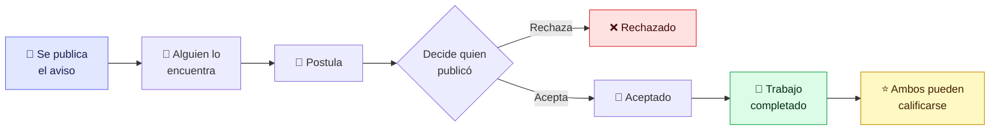
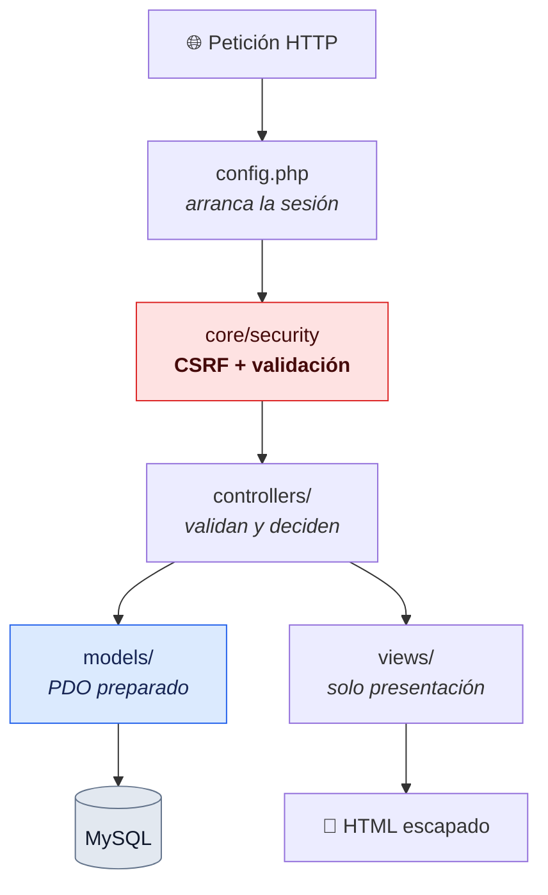

<div align="center">


# Chamba&nbsp;Ya

**Tu chamba al toque — sin CV y con contacto directo** ⚡

Marketplace de empleo y servicios que conecta a **trabajadores** con **quien los necesita**, cerca y al instante.

<br/>

[](https://www.php.net/)
[](https://mariadb.org/)
[](https://developer.mozilla.org/es/docs/Web/JavaScript)


</div>

---

> **Nota sobre este repositorio**
> Además de la plataforma, este proyecto documenta una **auditoría de seguridad completa**:
> 14 vulnerabilidades encontradas y corregidas, entre ellas una que permitía **tomar el
> control de cualquier cuenta**. Está todo en [Seguridad](#-seguridad), con el detalle de
> cómo se verificó cada arreglo.

---

## Contenido

- [¿Qué es Chamba Ya?](#-qué-es-chamba-ya)
- [Cómo funciona](#-cómo-funciona)
- [Funcionalidades](#-funcionalidades)
- [Tecnologías](#-tecnologías)
- [Arquitectura](#-arquitectura)
- [Instalación](#-instalación)
- [Seguridad](#-seguridad)
- [Autoría](#-autoría)

---

## 🧭 ¿Qué es Chamba Ya?

Un portal **de dos lados** pensado para el trabajo rápido e informal en Perú:

| | |
|---|---|
| 🟢 **Soy trabajador** | Encuentro ofertas cerca de mí y postulo en segundos |
| 🟡 **Necesito ayuda** | Busco gasfiteros, electricistas, limpieza o jardinería, o publico mi necesidad |

Sin currículums, sin intermediarios: **contacto directo** entre las personas.

**La misma cuenta sirve para las dos cosas.** Quien pinta una fachada un martes puede
contratar a un gasfitero el jueves, así que no hay cuentas de "cliente" y cuentas de
"trabajador" por separado. Hay un **modo activo** que la persona cambia cuando quiere y
que reordena su panel, sin quitarle ninguna capacidad.

---

## 🔄 Cómo funciona

El ciclo completo, desde que se publica un aviso hasta que se puede dejar una reseña:



La última flecha es una regla, no una sugerencia: **solo se puede calificar a alguien con
quien se completó un trabajo**, y cada reseña guarda de qué trabajo salió. Antes cualquiera
podía calificar a cualquiera sin haberlo conocido, lo que dejaba la puerta abierta a
reseñas inventadas.

---

## ✨ Funcionalidades

| | |
|---|---|
| 🔀 **Modo activo** | Cambia entre *buscar chamba* y *contratar*; reordena el panel sin tocar permisos |
| 🔎 **Búsqueda con filtros** | Texto libre, categoría múltiple, ubicación (departamento → provincia → distrito) y monto mínimo |
| 📢 **Avisos de trabajo y de servicio** | Dos flujos diferenciados, cada uno con su identidad visual |
| 📝 **Solicitudes con estado** | Pendiente → Aceptado → **Completado** (o Rechazado), con notificación en cada paso |
| 🖼️ **Portafolio** | Trabajos anteriores con foto, descripción y categoría, visibles en el perfil público |
| ⭐ **Reseñas verificables** | Estrellas y comentario, **solo entre quienes completaron un trabajo juntos** |
| 🛠️ **Habilidades** | Etiquetas que describen al trabajador y aparecen en su perfil |
| 🔔 **Notificaciones** | Avisos con contador de no leídas, y correo opcional |
| 💚 **Guardados y favoritos** | Guarda avisos y trabajadores para después |
| 💬 **Contacto por WhatsApp** | Comunicación directa, sin fricción |
| 🚩 **Reporte de avisos** | Moderación para mantener la plataforma sana |
| 🛡️ **Panel de administración** | Usuarios, avisos, categorías y reportes, con métricas |
| 🔐 **Cuentas seguras** | Registro, inicio de sesión, recuperación por enlace y gestión de cuenta |

---

## 🧱 Tecnologías

| Capa | Herramienta |
|---|---|
| Lenguaje | **PHP 8.2**, sin frameworks |
| Base de datos | **MySQL / MariaDB** — PDO con consultas preparadas reales (`EMULATE_PREPARES = false`) |
| Frontend | **HTML5, CSS3 y JavaScript vanilla** — sin build, sin npm |
| Servidor | **Apache** (XAMPP) |
| Recursos | Font Awesome, Boxicons, Google Fonts |

**No hay Composer ni `node_modules`.** Se clona y funciona. El autoloader de clases son
20 líneas propias en `core/config/autoload.php`. La decisión es deliberada: el objetivo
era entender qué hace un framework por dentro, no delegarlo.

---

## 🏗️ Arquitectura

Patrón **MVC** escrito a mano, con una capa de seguridad transversal:



```
Chamba-Ya/
├── index.php              Portada y enrutado de las vistas públicas
├── controllers/           Reciben la petición, validan y deciden
├── models/                Todo el acceso a datos (PDO preparado)
├── views/
│   ├── admin/             Panel de administración
│   ├── anuncios/          Búsqueda y detalle
│   ├── auth/              Inicio de sesión, registro y recuperación
│   ├── templates/         Cabecera, pie y barra lateral reutilizables
│   └── user/              Perfil y actividad del usuario
├── core/
│   ├── config/            Configuración, sesiones, entorno y correo
│   ├── db/                Conexión PDO
│   └── security/          CSRF y validación de entradas
├── database/              schema.sql, seed.sql y migraciones
└── assets/                CSS, JS e imágenes
```

<details>
<summary><b>Dos decisiones que conviene conocer antes de tocar el código</b></summary>

<br/>

**`config.php` es quien arranca la sesión.**
`session_start()` tiene que ejecutarse antes de la primera salida HTML, porque envía la
cookie de sesión en las cabeceras. Las vistas sueltas (`login.php`,
`recuperar_password.php`) incluyen `config.php` en su primera línea, así que es el único
punto donde el arranque es seguro para todas.

**`session.php` NO incluye `config.php`.**
Formarían un ciclo: `config.php` carga los helpers de seguridad y estos cargan
`session.php`. Cuando el primer archivo incluido era `session.php`, `config.php` se
ejecutaba desde dentro e invocaba `iniciarSesion()` antes de que se definieran sus
constantes — error fatal en la portada. Las dos funciones que necesitan `BASE_URL`
(`requireLogin` y `requireAdmin`) la cargan por su cuenta.

</details>

---

## 🚀 Instalación

Requiere **XAMPP** (o cualquier Apache con PHP 8.1+ y MySQL/MariaDB).

**1. Clonar dentro de `htdocs`**

```bash
git clone https://github.com/junniors-dev/Chamba-Ya.git
```

**2. Crear la base de datos**

```bash
mysql -u root -e "CREATE DATABASE bd_chamba_ya CHARACTER SET utf8mb4 COLLATE utf8mb4_general_ci;"
```

**3. Cargar estructura y datos de ejemplo**

```bash
mysql -u root bd_chamba_ya < database/schema.sql
```

```bash
mysql -u root bd_chamba_ya < database/seed.sql
```

`seed.sql` trae los 25 departamentos, 196 provincias y 1874 distritos del Perú, además de
las categorías, las habilidades y tres cuentas de prueba.

**4. Configurar el entorno**

```bash
cp core/config/env.example.php core/config/env.php
```

Ajusta usuario y contraseña de MySQL si los tuyos no son los de XAMPP por defecto.
`env.php` está en `.gitignore`: **las credenciales nunca se suben al repositorio.**

**5. Abrir** `http://localhost/Chamba-Ya/`

### Cuentas de prueba

| Correo | Rol | Contraseña |
|---|---|---|
| `ana.demo@chambaya.test` | Administradora | `Chamba2026!` |
| `carlos.demo@chambaya.test` | Usuario | `Chamba2026!` |
| `lucia.demo@chambaya.test` | Usuario | `Chamba2026!` |

Cuentas ficticias, creadas solo para poder probar el proyecto.

<details>
<summary><b>¿Vienes de una versión anterior?</b></summary>

<br/>

Sobre una base de datos que ya existía, aplica las migraciones en orden:

```bash
mysql -u root bd_chamba_ya < database/migracion_seguridad.sql
```

```bash
mysql -u root bd_chamba_ya < database/migracion_funcionalidades.sql
```

</details>

---

## 🔐 Seguridad

El proyecto pasó por una auditoría de autenticación y manejo de sesiones. Esta sección
documenta **qué estaba mal y cómo se corrigió**, porque las decisiones importan tanto
como el resultado.

### El fallo más grave

Recuperar la contraseña solo pedía **correo + teléfono**:

```php
// Antes — cualquiera podía tomar cualquier cuenta
$usuario = $this->userModel->getUserByEmail($correo);
if (!$usuario || trim($usuario['telefono']) !== $telefono) { /* error */ }
$this->userModel->updatePassword($usuario['idUsuario'], $newPassword);
```

El problema no era el código, sino la premisa: **el teléfono se publica en los anuncios**.
La plataforma tiene un botón de WhatsApp que lo muestra. Los dos "secretos" que protegían
la cuenta estaban a la vista en la misma web, y no había límite de intentos.

Ahora es un enlace con **token de un solo uso**, guardado hasheado (SHA-256), que caduca
en 30 minutos y se invalida al usarse.

### Lo que ya estaba bien

- **Contraseñas hasheadas** con `password_hash()` (bcrypt) y `password_verify()`. Nunca hubo texto plano.
- **Sin inyección SQL**: los 13 modelos usan PDO preparado. Incluso los `WHERE` dinámicos del panel construyen *placeholders*, nunca concatenan valores.
- **Salida escapada** con `htmlspecialchars()` y listas blancas para los mensajes que llegan por URL.
- **Comprobaciones de propiedad** antes de editar o borrar avisos y postulaciones.
- **Subida de archivos validada** por extensión, tamaño y **tipo MIME real** (`finfo`), que es lo que impide colar un `.php` renombrado a `.jpg`.

### Las 14 vulnerabilidades corregidas

| Sev | Problema | Corrección |
|:---:|---|---|
| 🔴 | **Toma de cuenta** por el flujo de recuperación descrito arriba | Token de un solo uso, hasheado, con caducidad |
| 🔴 | **Sin protección CSRF** en ningún formulario, incluido *hacer administrador* | Token por sesión con `hash_equals()`, en formularios, controladores y AJAX |
| 🔴 | **Session fixation**: el identificador de sesión no cambiaba al entrar | `session_regenerate_id(true)` en login, registro y cambio de contraseña |
| 🟠 | **Cookie de sesión sin flags**, legible por JavaScript | `httponly`, `samesite`, `secure` bajo HTTPS, `use_strict_mode` y caducidad |
| 🟠 | **Bloqueo de intentos evadible**: el contador vivía en `$_SESSION`, del lado del atacante | Tabla `intento_login`, contando por correo **e** IP |
| 🟠 | **Enumeración de usuarios**: la respuesta delataba qué correos existían | Respuesta idéntica, y comparación contra un hash ficticio para igualar también el tiempo |
| 🟡 | **`remember_token` sin rotar**, sobrevivía al cambio de contraseña | Rota en cada uso y se invalida al cambiarla, en la misma consulta |
| 🟡 | **Desactivar la cuenta no servía**: se reactivaba sola al entrar | Se separa la baja voluntaria de la sanción del administrador |
| 🟡 | **Borrar la cuenta con un solo clic** | Exige confirmar la contraseña actual |
| 🟡 | **Reseñas inventadas**: cualquiera podía calificar a cualquiera | Exige una postulación **Completada** entre ambos, y se guarda cuál |
| 🟡 | **Sin validación en servidor** de correo, teléfono ni longitudes | `core/security/validacion.php`, aplicado en registro, edición y recuperación |
| 🟡 | **Open redirect** en el cambio de modo | Solo se aceptan rutas internas |
| 🟡 | **Credenciales en el código** y error de conexión impreso al visitante | `env.php` fuera del repositorio; los errores solo al log |
| 🟡 | **Volcado SQL con 11 correos y hashes reales** en un repositorio público, sin `.gitignore` | Sustituido por `schema.sql` + `seed.sql` ficticios, y `.gitignore` añadido |

### Cuatro errores que solo aparecieron al ejecutar

Leyendo el código no se veían. Salieron al levantar el proyecto y probarlo de verdad:

- **El buscador estaba roto.** Repetía el mismo *placeholder* `:search` dos veces en una
  consulta, algo que MySQL rechaza cuando las consultas preparadas son reales.
- **PHP y MySQL iban con 7 horas de diferencia.** PHP escribía la fecha de caducidad y
  MySQL la comparaba con su propio `NOW()`, así que un enlace de 30 minutos duraba
  7 horas y media. Ahora los plazos los calcula la base de datos.
- **Dependencia circular** entre `config.php` y `session.php` que tumbaba la portada.
- **Rutas relativas `../`** en las vistas de autenticación, que dependían del directorio
  de trabajo y no del archivo.

### Cómo se verificó

Que compile no prueba nada. Cada arreglo se comprobó ejecutándolo contra la base real:

```
POST sin token CSRF                          →  419 rechazado
Contraseña incorrecta vs correo inexistente  →  respuesta idéntica
PHPSESSID antes y después del login          →  cambia
5 fallos borrando la cookie cada vez         →  bloquea igual
Enlace de recuperación reutilizado           →  rechazado
Contraseña antigua tras el reset             →  rechazada
Calificar sin trabajo completado             →  rechazado
Completar sin haber aceptado antes           →  rechazado
Completar o borrar algo ajeno                →  rechazado
PHP renombrado a .png                        →  rechazado por MIME real
Redirección a un dominio externo             →  forzada al inicio
50 métodos de modelo contra la base real     →  50 / 50
22 páginas públicas, de usuario y de admin   →  render completo, 0 errores PHP
93 archivos PHP                              →  compilan
schema.sql + seed.sql en base virgen         →  arranca
```

<details>
<summary><b>Lo que falta para llevarlo a producción</b></summary>

<br/>

Esto es un proyecto de portafolio y corre en XAMPP. Antes de exponerlo a internet:

- Servir todo por **HTTPS** (la cookie `secure` ya se activa sola al detectarlo).
- Configurar un **SMTP real**. XAMPP no envía correos, y por eso en modo desarrollo el
  enlace de recuperación se muestra en pantalla. Con `modo_dev = false` eso no ocurre.
- Mover `assets/uploads/` fuera de la raíz web, o negar la ejecución de PHP en esa carpeta
  con una regla de Apache.
- Añadir cabeceras `Content-Security-Policy` y `X-Frame-Options`.
- Crear un usuario de MySQL con permisos mínimos, en lugar de `root`.

</details>

---

## 👥 Autoría

**Mantenedor y desarrollador: [Junni Díaz — junniors-dev](https://github.com/junniors-dev)**

Chamba Ya arrancó en junio de 2026 como proyecto de equipo. Desde julio de 2026 el resto
del equipo dejó de participar y el proyecto lo llevo yo en solitario: soy el único que lo
mantiene, lo corrige y lo sigue desarrollando.

Es mío, íntegramente, todo lo descrito en la sección de **Seguridad** y las
funcionalidades añadidas después:

- La auditoría completa de autenticación y sesiones, y las 14 vulnerabilidades corregidas
- Protección CSRF, endurecimiento de sesiones y recuperación de contraseña por token
- Bloqueo de intentos persistente, validación en servidor y saneamiento del repositorio
- Modo activo, portafolio de trabajos y ciclo de trabajo con estado *Completado*
- Reseñas verificables, ligadas a un trabajo realmente completado

El detalle de la etapa inicial está en el historial del repositorio.

---

<div align="center">

Hecho con 💚💛 para que encontrar chamba sea **al toque**.

</div>
