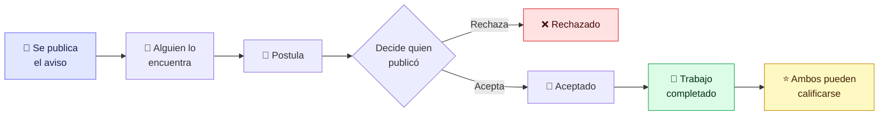
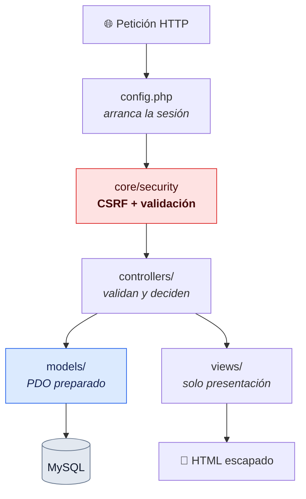

<div align="center">


# Chamba&nbsp;Ya

**Tu chamba al toque — sin CV y con contacto directo** ⚡

Marketplace de empleo y servicios que conecta a **trabajadores** con **quien los necesita**, cerca y al instante.

<br/>

[](https://www.php.net/)
[](https://mariadb.org/)
[](https://developer.mozilla.org/es/docs/Web/JavaScript)


</div>

---

> **Sobre este repositorio**
> Junto a la plataforma, el proyecto incluye una **auditoría de seguridad** del flujo de
> autenticación y la gestión de sesiones: 14 hallazgos clasificados según CWE y OWASP
> Top 10, corregidos y verificados. El más grave permitía tomar el control de cualquier
> cuenta. El informe completo está en [Seguridad](#-seguridad).

---

## Contenido

- [¿Qué es Chamba Ya?](#-qué-es-chamba-ya)
- [Cómo funciona](#-cómo-funciona)
- [Funcionalidades](#-funcionalidades)
- [Tecnologías](#-tecnologías)
- [Arquitectura](#-arquitectura)
- [Instalación](#-instalación)
- [Seguridad](#-seguridad)
- [Autoría](#-autoría)

---

## 🧭 ¿Qué es Chamba Ya?

Un portal **de dos lados** pensado para el trabajo rápido e informal en Perú:

| | |
|---|---|
| 🟢 **Soy trabajador** | Encuentro ofertas cerca de mí y postulo en segundos |
| 🟡 **Necesito ayuda** | Busco gasfiteros, electricistas, limpieza o jardinería, o publico mi necesidad |

Sin currículums, sin intermediarios: **contacto directo** entre las personas.

**La misma cuenta sirve para las dos cosas.** Quien pinta una fachada un martes puede
contratar a un gasfitero el jueves, así que no hay cuentas de "cliente" y cuentas de
"trabajador" por separado. Hay un **modo activo** que la persona cambia cuando quiere y
que reordena su panel, sin quitarle ninguna capacidad.

---

## 🔄 Cómo funciona

El ciclo completo, desde que se publica un aviso hasta que se puede dejar una reseña:



La última flecha es una regla, no una sugerencia: **solo se puede calificar a alguien con
quien se completó un trabajo**, y cada reseña guarda de qué trabajo salió. Antes cualquiera
podía calificar a cualquiera sin haberlo conocido, lo que dejaba la puerta abierta a
reseñas inventadas.

---

## ✨ Funcionalidades

| | |
|---|---|
| 🔀 **Modo activo** | Cambia entre *buscar chamba* y *contratar*; reordena el panel sin tocar permisos |
| 🔎 **Búsqueda con filtros** | Texto libre, categoría múltiple, ubicación (departamento → provincia → distrito) y monto mínimo |
| 📢 **Avisos de trabajo y de servicio** | Dos flujos diferenciados, cada uno con su identidad visual |
| 📝 **Solicitudes con estado** | Pendiente → Aceptado → **Completado** (o Rechazado), con notificación en cada paso |
| 🖼️ **Portafolio** | Trabajos anteriores con foto, descripción y categoría, visibles en el perfil público |
| ⭐ **Reseñas verificables** | Estrellas y comentario, **solo entre quienes completaron un trabajo juntos** |
| 🛠️ **Habilidades** | Etiquetas que describen al trabajador y aparecen en su perfil |
| 🔔 **Notificaciones** | Avisos con contador de no leídas, y correo opcional |
| 💚 **Guardados y favoritos** | Guarda avisos y trabajadores para después |
| 💬 **Contacto por WhatsApp** | Comunicación directa, sin fricción |
| 🚩 **Reporte de avisos** | Moderación para mantener la plataforma sana |
| 🛡️ **Panel de administración** | Usuarios, avisos, categorías y reportes, con métricas |
| 🔐 **Cuentas seguras** | Registro, inicio de sesión, recuperación por enlace y gestión de cuenta |

---

## 🧱 Tecnologías

| Capa | Herramienta |
|---|---|
| Lenguaje | **PHP 8.2**, sin frameworks |
| Base de datos | **MySQL / MariaDB** — PDO con consultas preparadas reales (`EMULATE_PREPARES = false`) |
| Frontend | **HTML5, CSS3 y JavaScript vanilla** — sin build, sin npm |
| Servidor | **Apache** (XAMPP) |
| Recursos | Font Awesome, Boxicons, Google Fonts |

**No hay Composer ni `node_modules`.** Se clona y funciona. El autoloader de clases son
20 líneas propias en `core/config/autoload.php`. La decisión es deliberada: el objetivo
era entender qué hace un framework por dentro, no delegarlo.

---

## 🏗️ Arquitectura

Patrón **MVC** escrito a mano, con una capa de seguridad transversal:



```
Chamba-Ya/
├── index.php              Portada y enrutado de las vistas públicas
├── controllers/           Reciben la petición, validan y deciden
├── models/                Todo el acceso a datos (PDO preparado)
├── views/
│   ├── admin/             Panel de administración
│   ├── anuncios/          Búsqueda y detalle
│   ├── auth/              Inicio de sesión, registro y recuperación
│   ├── templates/         Cabecera, pie y barra lateral reutilizables
│   └── user/              Perfil y actividad del usuario
├── core/
│   ├── config/            Configuración, sesiones, entorno y correo
│   ├── db/                Conexión PDO
│   └── security/          CSRF y validación de entradas
├── database/              schema.sql, seed.sql y migraciones
└── assets/                CSS, JS e imágenes
```

<details>
<summary><b>Dos decisiones que conviene conocer antes de tocar el código</b></summary>

<br/>

**`config.php` es quien arranca la sesión.**
`session_start()` tiene que ejecutarse antes de la primera salida HTML, porque envía la
cookie de sesión en las cabeceras. Las vistas sueltas (`login.php`,
`recuperar_password.php`) incluyen `config.php` en su primera línea, así que es el único
punto donde el arranque es seguro para todas.

**`session.php` NO incluye `config.php`.**
Formarían un ciclo: `config.php` carga los helpers de seguridad y estos cargan
`session.php`. Cuando el primer archivo incluido era `session.php`, `config.php` se
ejecutaba desde dentro e invocaba `iniciarSesion()` antes de que se definieran sus
constantes — error fatal en la portada. Las dos funciones que necesitan `BASE_URL`
(`requireLogin` y `requireAdmin`) la cargan por su cuenta.

</details>

---

## 🚀 Instalación

Requiere **XAMPP** (o cualquier Apache con PHP 8.1+ y MySQL/MariaDB).

**1. Clonar dentro de `htdocs`**

```bash
git clone https://github.com/junniors-dev/Chamba-Ya.git
```

**2. Crear la base de datos**

```bash
mysql -u root -e "CREATE DATABASE bd_chamba_ya CHARACTER SET utf8mb4 COLLATE utf8mb4_general_ci;"
```

**3. Cargar estructura y datos de ejemplo**

```bash
mysql -u root bd_chamba_ya < database/schema.sql
```

```bash
mysql -u root bd_chamba_ya < database/seed.sql
```

`seed.sql` trae los 25 departamentos, 196 provincias y 1874 distritos del Perú, además de
las categorías, las habilidades y tres cuentas de prueba.

**4. Configurar el entorno**

```bash
cp core/config/env.example.php core/config/env.php
```

Ajusta usuario y contraseña de MySQL si los tuyos no son los de XAMPP por defecto.
`env.php` está en `.gitignore`: **las credenciales nunca se suben al repositorio.**

**5. Abrir** `http://localhost/Chamba-Ya/`

### Cuentas de prueba

| Correo | Rol | Contraseña |
|---|---|---|
| `ana.demo@chambaya.test` | Administradora | `Chamba2026!` |
| `carlos.demo@chambaya.test` | Usuario | `Chamba2026!` |
| `lucia.demo@chambaya.test` | Usuario | `Chamba2026!` |

Cuentas ficticias, creadas solo para poder probar el proyecto.

<details>
<summary><b>¿Vienes de una versión anterior?</b></summary>

<br/>

Sobre una base de datos que ya existía, aplica las migraciones en orden:

```bash
mysql -u root bd_chamba_ya < database/migracion_seguridad.sql
```

```bash
mysql -u root bd_chamba_ya < database/migracion_funcionalidades.sql
```

</details>

---

## 🔐 Seguridad

### Alcance y metodología

Auditoría de caja blanca sobre el flujo de autenticación, la gestión de sesiones y el
control de acceso. Se revisaron los 13 modelos, los 14 controladores y las 38 vistas del
proyecto.

Cada hallazgo se confirmó **ejecutando la aplicación** contra la base de datos real
—no únicamente por inspección estática— y cada corrección se validó con la prueba
correspondiente antes de darla por cerrada. El conjunto de cambios está en
[PR #1](https://github.com/junniors-dev/Chamba-Ya/pull/1).

### Resumen

| Severidad | Hallazgos | Estado |
|:---|:---:|:---|
| Crítica | 3 | Corregidos |
| Alta | 3 | Corregidos |
| Media | 8 | Corregidos |
| **Total** | **14** | **Corregidos** |

La clasificación sigue [CWE](https://cwe.mitre.org/) y las categorías de
[OWASP Top 10 (2021)](https://owasp.org/Top10/es/).

### Hallazgos

| ID | Severidad | Hallazgo | Clasificación | Corrección aplicada |
|:---|:---|:---|:---|:---|
| CY-01 | Crítica | Restablecimiento de contraseña basado en datos de acceso público | CWE-640 · A07 | Token de un solo uso, almacenado como hash SHA-256, con caducidad de 30 minutos |
| CY-02 | Crítica | Ausencia total de protección CSRF, incluida la elevación de privilegios a administrador | CWE-352 · A01 | Token por sesión validado con `hash_equals()` en formularios, controladores y peticiones AJAX |
| CY-03 | Crítica | Fijación de sesión: el identificador no se renovaba tras la autenticación | CWE-384 · A07 | `session_regenerate_id(true)` en inicio de sesión, registro y cambio de contraseña |
| CY-04 | Alta | Cookie de sesión sin atributos de seguridad, accesible desde JavaScript | CWE-1004 · CWE-614 · A05 | `httponly`, `samesite`, `secure` bajo HTTPS, `use_strict_mode` y caducidad por inactividad |
| CY-05 | Alta | Limitación de intentos de acceso almacenada en el lado del cliente | CWE-307 · CWE-602 · A07 | Registro en la tabla `intento_login`, contabilizado por correo e IP |
| CY-06 | Alta | Enumeración de usuarios por discrepancia en las respuestas | CWE-204 · A07 | Respuesta uniforme y verificación contra un hash señuelo para igualar el tiempo de respuesta |
| CY-07 | Media | Token de sesión persistente sin rotación ni revocación al cambiar la contraseña | CWE-613 · A07 | Rotación en cada uso e invalidación en la misma consulta que actualiza la contraseña |
| CY-08 | Media | La desactivación de cuenta se revertía automáticamente al iniciar sesión | CWE-285 · A01 | Distinción entre baja voluntaria (`Inactivo`) y sanción administrativa (`Suspendido`/`Bloqueado`) |
| CY-09 | Media | Eliminación de cuenta sin reautenticación | CWE-306 · A07 | Se exige la contraseña actual para completar la operación |
| CY-10 | Media | Calificaciones emitibles sin relación verificable entre las partes | CWE-862 · A01 | Se requiere una postulación en estado `Completado`; la reseña queda vinculada a ella |
| CY-11 | Media | Validación de entrada ausente en el servidor | CWE-20 · A03 | `core/security/validacion.php`, aplicado en registro, edición de perfil y recuperación |
| CY-12 | Media | Redirección abierta en el cambio de modo de usuario | CWE-601 · A01 | Se aceptan exclusivamente rutas internas; el resto se redirige al inicio |
| CY-13 | Media | Credenciales embebidas en el código y divulgación de errores al cliente | CWE-798 · CWE-209 · A05 | Configuración en `env.php`, excluido del control de versiones; los errores solo al registro del servidor |
| CY-14 | Media | Datos personales expuestos en el repositorio público (11 direcciones de correo y sus hashes) | CWE-538 · A01 | Sustitución por `schema.sql` y `seed.sql` con datos sintéticos, e incorporación de `.gitignore` |

### CY-01 — Restablecimiento de contraseña basado en datos de acceso público

**Descripción.** El procedimiento de recuperación autenticaba al solicitante mediante la
combinación de correo electrónico y número de teléfono:

```php
// Implementación vulnerable
$usuario = $this->userModel->getUserByEmail($correo);
if (!$usuario || trim($usuario['telefono']) !== $telefono) { /* error */ }
$this->userModel->updatePassword($usuario['idUsuario'], $newPassword);
```

**Impacto.** El defecto no reside en la implementación sino en la premisa: **el número de
teléfono se publica en los propios anuncios** de la plataforma, que incorpora un enlace de
contacto por WhatsApp construido a partir de ese dato. Ambos factores de verificación eran
públicos y estaban disponibles en la misma aplicación, sin límite de intentos. Cualquier
visitante podía tomar el control de cualquier cuenta, incluidas las de administración.

**Corrección.** Se sustituyó por un enlace de un solo uso con token aleatorio de 256 bits,
almacenado como hash SHA-256, con caducidad de 30 minutos e invalidación tras el primer
uso. La respuesta del formulario es uniforme exista o no la cuenta, para no reintroducir
por esta vía la enumeración de usuarios corregida en CY-06.

### Controles verificados como correctos

Los siguientes mecanismos ya estaban correctamente implementados y no requirieron cambios:

- **Almacenamiento de contraseñas** mediante `password_hash()` (bcrypt) y `password_verify()`. No se detectó almacenamiento en claro en ningún punto.
- **Prevención de inyección SQL**: los 13 modelos emplean PDO con sentencias preparadas. Las cláusulas `WHERE` dinámicas del panel de administración generan marcadores de posición en lugar de concatenar valores.
- **Codificación de salida** con `htmlspecialchars()`, complementada con listas de permitidos para los mensajes procedentes de la URL.
- **Control de propiedad de recursos** previo a la edición y eliminación de anuncios y postulaciones.
- **Validación de archivos subidos** por extensión, tamaño y **tipo MIME real** (`finfo`), lo que impide la carga de un archivo PHP con extensión de imagen.

### Defectos detectados durante la verificación

La ejecución de las pruebas reveló cuatro defectos preexistentes que la inspección estática
no evidenciaba:

| Defecto | Causa |
|:---|:---|
| El buscador dejaba de funcionar con sentencias preparadas nativas | Reutilización del mismo marcador `:search` dos veces en una sola consulta, que MySQL rechaza cuando `EMULATE_PREPARES` está desactivado |
| Los plazos de caducidad se calculaban mal por un margen de 7 horas | PHP registraba la fecha de expiración y MySQL la comparaba con su propio `NOW()`, con zonas horarias distintas. Un enlace de 30 minutos permanecía válido 7 h 30 min |
| Error fatal en la página principal | Dependencia circular entre `config.php` y `session.php` |
| Vistas de autenticación con carga inestable | Rutas relativas `../` resueltas contra el directorio de trabajo en lugar del archivo |

### Verificación

| Prueba | Resultado |
|:---|:---|
| Petición POST sin token CSRF | Rechazada (HTTP 419) |
| Contraseña incorrecta frente a correo inexistente | Respuesta idéntica |
| Identificador de sesión antes y después de autenticarse | Se renueva |
| Cinco intentos fallidos eliminando la cookie en cada uno | Bloqueo aplicado |
| Reutilización de un enlace de recuperación | Rechazada |
| Autenticación con la contraseña anterior al restablecimiento | Rechazada |
| Calificación sin trabajo completado entre las partes | Rechazada |
| Cierre de un trabajo sin aceptación previa | Rechazado |
| Cierre o eliminación de recursos de otro usuario | Rechazado |
| Carga de un archivo PHP con extensión `.png` | Rechazada por verificación MIME |
| Redirección hacia un dominio externo | Forzada al inicio de la aplicación |
| Métodos de modelo ejecutados contra la base de datos | 50 / 50 correctos |
| Páginas públicas, de usuario y de administración | 22 / 22 con render completo y sin errores |
| Archivos PHP del repositorio | 93 / 93 sin errores de sintaxis |
| Instalación desde `schema.sql` y `seed.sql` en base vacía | Correcta |

<details>
<summary><b>Limitaciones y recomendaciones para un despliegue en producción</b></summary>

<br/>

El proyecto está concebido para un entorno de desarrollo local (XAMPP). Antes de exponerlo
públicamente conviene atender los siguientes puntos, fuera del alcance de esta auditoría:

- Servir la aplicación exclusivamente sobre **HTTPS**. El atributo `secure` de la cookie se activa automáticamente al detectarlo.
- Configurar un **servidor SMTP**. XAMPP no entrega correo, motivo por el cual el enlace de recuperación se muestra en pantalla cuando `modo_dev` está activo. Con `modo_dev = false` ese comportamiento queda deshabilitado.
- Reubicar `assets/uploads/` fuera de la raíz web, o denegar la ejecución de PHP en ese directorio mediante configuración de Apache.
- Incorporar las cabeceras `Content-Security-Policy` y `X-Frame-Options`.
- Emplear un usuario de base de datos con privilegios mínimos en lugar de `root`.

</details>

---

## 👥 Autoría

**Mantenedor y desarrollador: [Junni Díaz — junniors-dev](https://github.com/junniors-dev)**

Chamba Ya se inició en junio de 2026 como proyecto de equipo. Desde julio de 2026 su
desarrollo y mantenimiento corresponden a un único responsable.

Son de autoría propia la auditoría de seguridad descrita en este documento y las
funcionalidades incorporadas con posterioridad:

- Auditoría de autenticación y gestión de sesiones, con la corrección de los 14 hallazgos
- Protección CSRF, endurecimiento de sesiones y restablecimiento de contraseña por token
- Control de intentos de acceso persistente, validación en servidor y saneamiento del repositorio
- Modo activo de usuario, portafolio de trabajos y ciclo de trabajo con estado `Completado`
- Sistema de reseñas verificables, vinculadas a un trabajo efectivamente completado

El historial del repositorio documenta la etapa inicial.

---

<div align="center">

**Chamba Ya** · Marketplace de empleo y servicios
[Repositorio](https://github.com/junniors-dev/Chamba-Ya) · [Auditoría de seguridad](https://github.com/junniors-dev/Chamba-Ya/pull/1)

</div>
